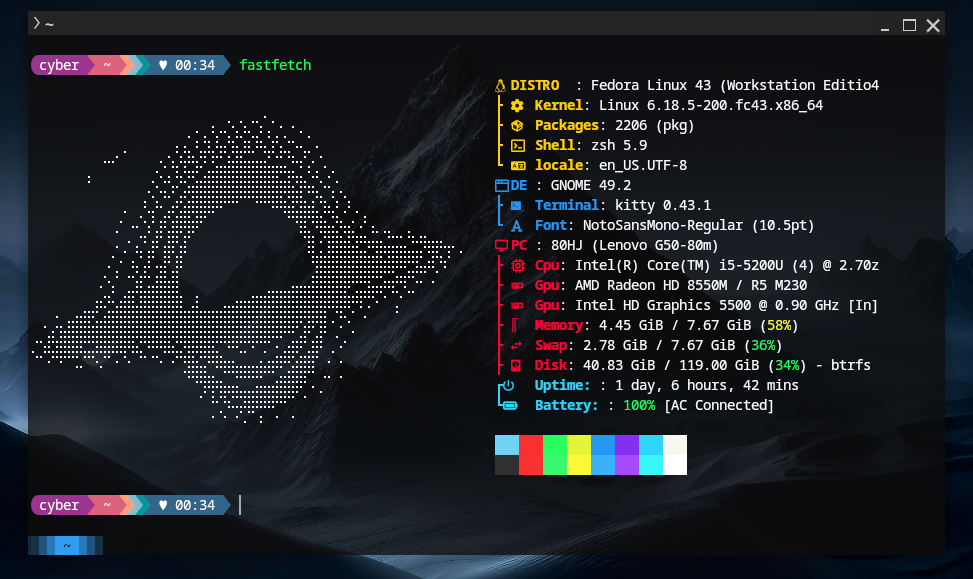

# 🧰 DotFiles

✨ Personal Linux dotfiles for a **clean, fast, and aesthetic terminal setup**.

This repository contains my configuration files for **Fastfetch** , **Kitty** ,**Zsh** , **Starship** and , organized in a simple, modular, and reproducible way.

---

## 🖼️ Preview

### Fastfetch


---

## 📁 Repository Structure

```text
.
├── Fastfetch
│   ├── assets
│   │   ├── ascii2.txt        # Custom ASCII logo
│   │   └── fastfetch.png     # Fastfetch preview image
│   └── config.jsonc          # Fastfetch configuration
├── Kitty
│   └── kitty.conf            # Kitty terminal config
├── Starship
│   └── starship.toml         # Starship prompt config
├── Zsh
│   └── .zshrc                # Zsh configuration
└── README.md
```

---

## 🖥️ Tools & Stack

- **Shell**: Zsh  
- **Prompt**: Starship  
- **Terminal Emulator**: Kitty  
- **System Fetch**: Fastfetch  
- **Fonts**: Nerd Fonts (required for icons)

---

## ⚙️ Installation

### 1️⃣ Clone the repository

```bash
git clone https://github.com/Aman-0309/DotFiles.git ~/DotFiles
```

---

### 2️⃣ Create symbolic links (recommended)

Using symlinks keeps your `$HOME` clean and allows easy syncing across systems.

#### Zsh
```bash
ln -s ~/DotFiles/Zsh/.zshrc ~/.zshrc
```

#### Starship
```bash
mkdir -p ~/.config
ln -s ~/DotFiles/Starship/starship.toml ~/.config/starship.toml
```

#### Fastfetch
```bash
mkdir -p ~/.config/fastfetch
ln -s ~/DotFiles/Fastfetch/config.jsonc ~/.config/fastfetch/config.jsonc
ln -s ~/DotFiles/Fastfetch/assets ~/.config/fastfetch/assets
```

#### Kitty
```bash
mkdir -p ~/.config/kitty
ln -s ~/DotFiles/Kitty/kitty.conf ~/.config/kitty/kitty.conf
```

---

## 🚀 Enable Starship

Make sure this line exists at the **end** of your `~/.zshrc`:

```zsh
eval "$(starship init zsh)"
```

Reload the shell:

```bash
source ~/.zshrc
```

---

## 📦 Dependencies

Make sure the following packages are installed:

- `zsh`
- `starship`
- `kitty`
- `fastfetch`
- `git`
- **Nerd Font**  
  (JetBrainsMono Nerd Font)

---

## 🎨 Features

- Clean and consistent color theme  
- Nerd Font icons support  
- Starship prompt matched with Fastfetch styling  
- Modular dotfiles structure  
- Easy to extend (Neovim, tmux, etc.)

---

## 🛠️ Customization

- Tweak terminal appearance → `Kitty/kitty.conf`
- Adjust system info layout → `Fastfetch/config.jsonc`
- Modify prompt behavior → `Starship/starship.toml`
- Add aliases/functions → `Zsh/.zshrc`

---

## 📜 License

These dotfiles are for personal use.  
Feel free to fork, adapt, and customize them for your own setup.

---

