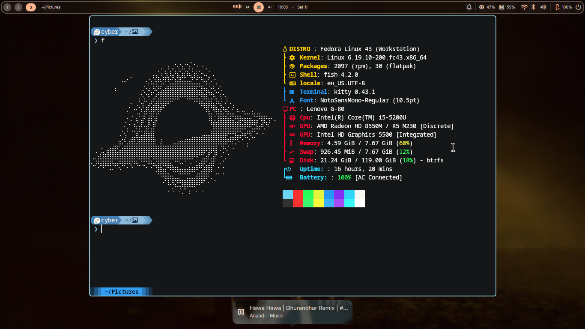

# 🧰 DotFiles

✨ Personal Linux dotfiles for a **clean, fast, and aesthetic terminal & desktop setup**.

This repository contains configuration files for **Fastfetch, Kitty, Zsh, Fish, Starship, Btop, Niri, Zed, and DMS** — organized in a simple, modular, and reproducible way.

---

## 🖼️ Preview

### Fastfetch


---

## 📁 Repository Structure

```text
.
├── Btop
│   ├── btop.conf
│   └── themes
│       └── current.theme
├── Dms
│   ├── setting.json
│   └── zen.css
├── Fastfetch
│   ├── assets
│   │   ├── ascii2.txt
│   │   ├── fastfetch1.png
│   │   └── fastfetch.png
│   └── config.jsonc
├── Fish
│   └── config.fish
├── Kitty
│   └── kitty.conf
├── Niri
│   └── config.kdl
├── Starship
│   ├── starship.toml
│   ├── starship_first.toml
│   └── starship-fish.toml
├── Zed
│   └── settings.json
├── Zsh
│   └── .zshrc
└── README.md
```

---

## 🖥️ Tools & Stack

| Tool | Purpose |
|------|---------|
| Zsh, Fish | Shells |
| Starship | Prompt |
| Kitty | Terminal Emulator |
| Fastfetch | System Fetch |
| Btop | System Monitor |
| Niri | Compositor / WM |
| Zed | Editor |
| DMS | Launcher / Custom UI |
| Nerd Fonts | Icons (required) |

---

## ⚙️ Installation

### 1️⃣ Clone the Repository

```bash
git clone https://github.com/Aman-0309/DotFiles.git ~/DotFiles
```

### 2️⃣ Create Symbolic Links

Using symlinks keeps your `$HOME` clean and allows easy syncing across systems.

#### 🐚 Zsh
```bash
ln -s ~/DotFiles/Zsh/.zshrc ~/.zshrc
```

#### 🐟 Fish
```bash
mkdir -p ~/.config/fish
ln -s ~/DotFiles/Fish/config.fish ~/.config/fish/config.fish
```

#### 🚀 Starship
```bash
mkdir -p ~/.config
ln -s ~/DotFiles/Starship/starship.toml ~/.config/starship.toml
```

> For Fish users:
> ```bash
> ln -s ~/DotFiles/Starship/starship-fish.toml ~/.config/starship.toml
> ```

#### ⚡ Fastfetch
```bash
mkdir -p ~/.config/fastfetch
ln -s ~/DotFiles/Fastfetch/config.jsonc ~/.config/fastfetch/config.jsonc
ln -s ~/DotFiles/Fastfetch/assets ~/.config/fastfetch/assets
```

#### 🐱 Kitty
```bash
mkdir -p ~/.config/kitty
ln -s ~/DotFiles/Kitty/kitty.conf ~/.config/kitty/kitty.conf
```

#### 📊 Btop
```bash
mkdir -p ~/.config/btop
ln -s ~/DotFiles/Btop/btop.conf ~/.config/btop/btop.conf
ln -s ~/DotFiles/Btop/themes ~/.config/btop/themes
```

#### 🧊 Niri
```bash
mkdir -p ~/.config/niri
ln -s ~/DotFiles/Niri/config.kdl ~/.config/niri/config.kdl
```

#### 📝 Zed
```bash
mkdir -p ~/.config/zed
ln -s ~/DotFiles/Zed/settings.json ~/.config/zed/settings.json
```

#### 🎨 DMS
```bash
mkdir -p ~/.config/dms
ln -s ~/DotFiles/Dms/setting.json ~/.config/dms/setting.json
ln -s ~/DotFiles/Dms/zen.css ~/.config/dms/zen.css
```

---

## 📦 Dependencies

Make sure the following packages are installed:

- `zsh`
- `fish`
- `starship`
- `kitty`
- `fastfetch`
- `btop`
- `git`
- `niri`
- `zed`
- Nerd Font *(JetBrainsMono Nerd Font recommended)*

---

## 🎨 Features

- ✅ Clean and consistent UI across tools
- ✅ Nerd Font icons support
- ✅ Unified theme across terminal + system tools
- ✅ Multi-shell support (Zsh + Fish)
- ✅ Modular dotfiles structure
- ✅ Easy to extend (Neovim, tmux, etc.)

---


## 📜 License

These dotfiles are for personal use. Feel free to fork, adapt, and customize them for your own setup.